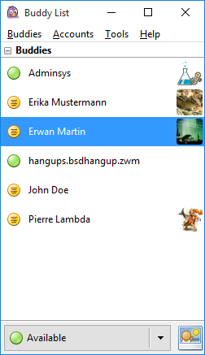
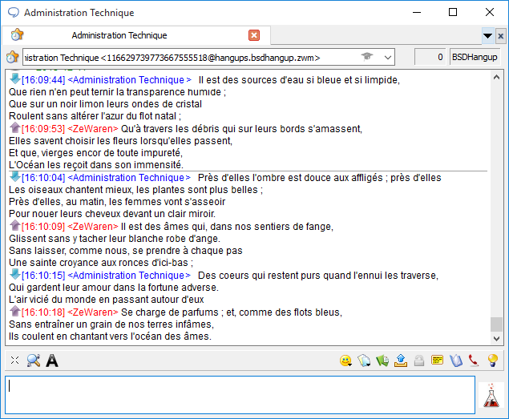
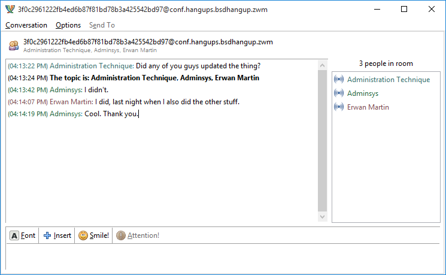

# Hangouts transport for Jabber/XMPP

## Introduction

This program implements a XMPP [transport/gateway](https://en.wikipedia.org/wiki/XMPP#Connecting_to_other_protocols)
for Google Hangouts.

It allows Jabber users to communicate with people using Hangouts.

It communicates with Jabber servers using Alexey Nezhdanov's [xmpppy library](http://xmpppy.sourceforge.net/) and with
Hangouts using a modified version of Tom Dryer's [hangups library](https://github.com/tdryer/hangups).

It has only been tested with Python 3.4 and ejabberd but it should work on other versions of Python and with other
Jabber servers.

It is currently (2015-12) in its first alpha version, and thus bugs should be expected. 

Testers, documentation writers, packagers, welcome!

## Features

* Contact presence.
* Regular chats.
* Group chats (implemented as XMPP conferences). When a message is received and the conference is not opened by the
client, an invitation is sent to it. When a conference is opened, the last 50 events are fetched and displayed.

## TODO
* Find bugs and correct them.
* Create packages and distribute them.
* Implement [XEP-0071: XHTML-IM](http://www.xmpp.org/extensions/xep-0071.html).
* Implement file transfers to upload images into chats.

## Installation
### FreeBSD
Install Python 3.4 and bootstrap pip.
    
    # make -C /usr/ports/lang/python3.4 install clean
    # python3.4 -m ensurepip
    
Install the required Python packages:

    # pip3.4 install -r requirements.txt

### Debian 8 (Jessie)
Install Python 3.4, virtualenv, and git:

    # apt-get install virtualenv git
    
Clone jabber-hangouts-transport:

    $ git clone https://github.com/ZeWaren/jabber-hangouts-transport.git

Create a new virtual environment:

    $ cd jabber-hangouts-transport
    $ virtualenv -p python3 env

Install the required Python packages:

    $ env/bin/pip install -r requirements.txt

### Other systems
The transport should run fine on any system running python and its packages. If you tested one successfully, please
create a merge request with the updated version of this file.

## Usage

### Configuration
#### Transport configuration
The program will look for a config file in the following locations:

* `config.xml`
* `/usr/local/etc/config.xml`    
* `/etc/config.xml`

Please look at the comments in the provided example config file for information about the format.

#### XMPP server configuration
##### Ejabberd
<pre>
  -
    port: 5237
    module: ejabberd_service
    hosts:
      "hangups.example.net":
        password: "secret"
</pre>

### Startup

    # python3.4 __main__.py

## Changelog
* 1.0.0a: first Alpha.

## Licence
See file [LICENSE](LICENSE).

